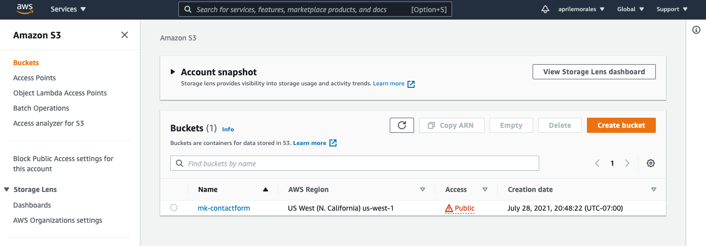
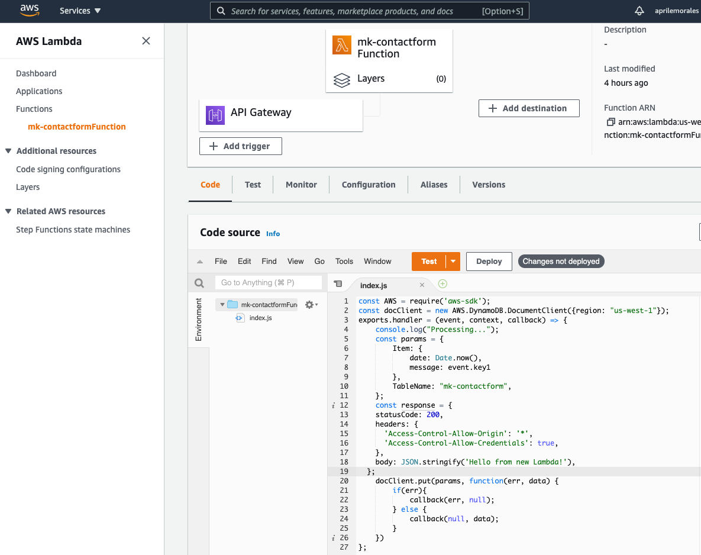
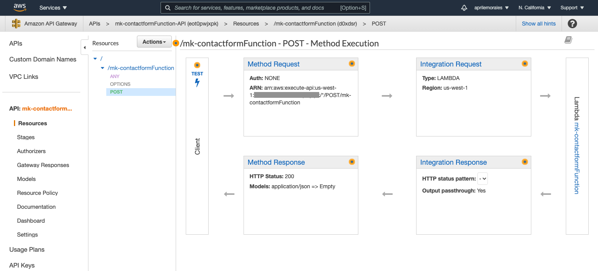
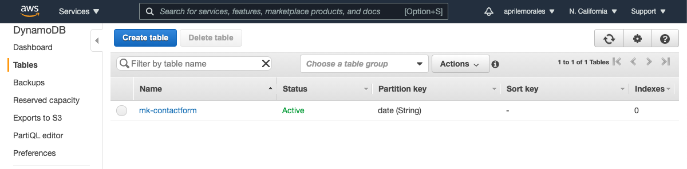
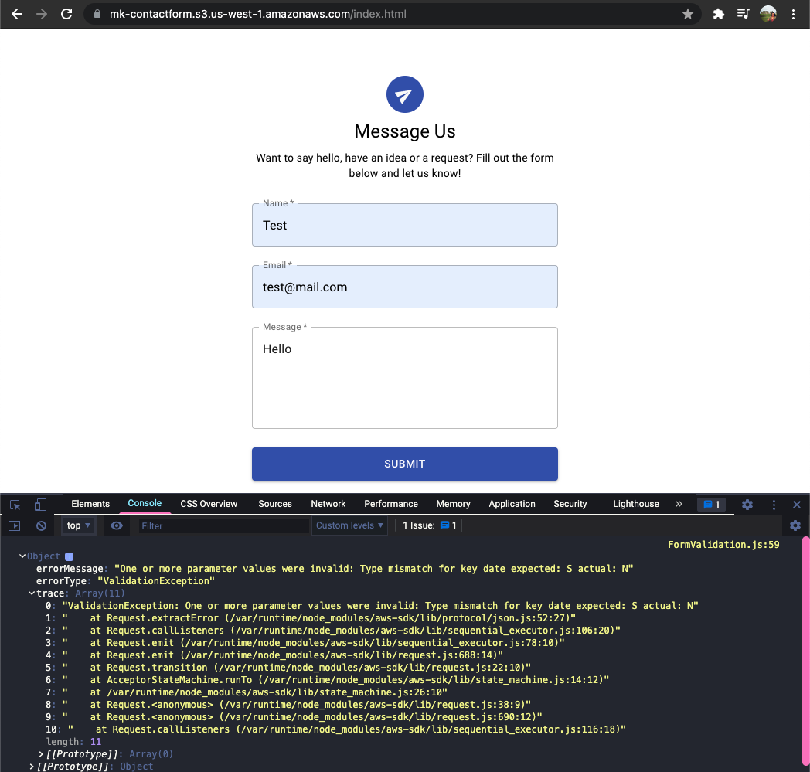

# Creating Contact Form AKA MK Contact Form

This project was bootstrapped with [Create React App](https://github.com/facebook/create-react-app).

This is the repo where the MK User Interface Engineer Challenge code submission from April Morales for the project to build a contact form can be found.

## AWS link to contact form site hosted in an S3 bucket

[MK Contact Form: https://mk-contactform.s3.us-west-1.amazonaws.com/index.html](https://mk-contactform.s3.us-west-1.amazonaws.com/index.html)

### Notes

Completed building the contact form with validation using React and Material UI. I used Formik and Yup to help with React form handling, validation and validation messaging. The contact form site / React app is up and hosted in AWS S3 bucket (can be viewed in link provided above). I also created an API Gateway that triggers a Lambda function and a table in DynamoDB.

S3 Bucket in AWS:

Lambda Function in AWS:

API Gateway POST Method:

DynamoDB Table in AWS:

I was not able to get the form submission to update the DynamoDB table or email using AWS SES. First I worked through a CORS error by updating the Lambda function POST method to enable CORS. I also corrected errors in my async / fetch function syntax. However, I wasn't able to find a solution in my research to an error regarding invalid paramater values.

Error:

### Experience Summary

Overall this project / challenge was a learning experience. I had fun walking through and using new tools. The only thing I was familiar with was React. This is the first time using Material UI, AWS S3, Lambda, API Gateway, DynamoDB, IAM and even looking into SES functionality. I will continue to work on my skills specifically different methods (POST, GET, etc) in which I need to be better at. As well as my JavaScript, React and full stack development. Thank you!
